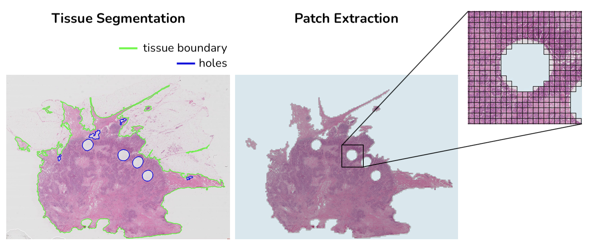
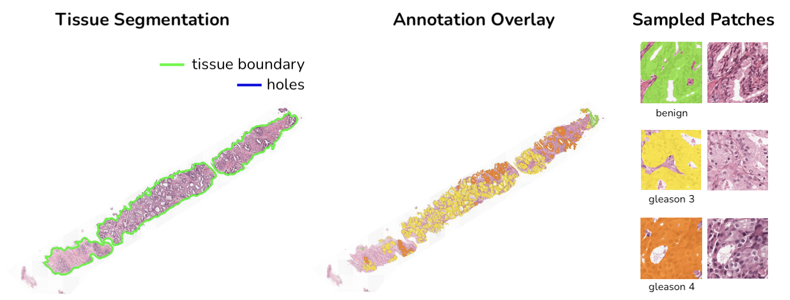

<h1 align="center">Histopathology Slide Pre-processing Pipeline</h1>


HS2P is an open-source project largely based on [CLAM](https://github.com/mahmoodlab/CLAM) tissue segmentation and patching code.

<p>
   <a href="https://github.com/psf/black"></a>
   <a href="https://github.com/PyCQA/pylint"></a>
</p>

## Requirements

install requirements via `pip3 install -r requirements.txt`

## Patch Extraction: Step-by-step guide



1. [Optional] Configure wandb

If you want to benefit from wandb logging, you need to follow these simple steps:
 - grab your wandb API key under your profile and export
 - run the following command in your terminal: `export WANDB_API_KEY=<your_personal_key>`
 - change wandb paramters in the configuration file under `config/` (set `enable` to `True`)

2. Create a .csv file containing paths to the desired slides:

```
slide_id,slide_path
slide_id_1,path/to/slide_1.tif
slide_id_2,path/to/slide_2.tif
...
```

You can optionally provide paths to pre-computed segmentation masks under the 'segmentation_mask_path' column

```
slide_id,slide_path,segmentation_mask_path
slide_id_1,path/to/slide_1.tif,path/to/slide_1_mask.tif
slide_id_2,path/to/slide_2.tif,path/to/slide_2_mask.tif
...
```

3. Create a configuration file under `config/extraction/`

A good starting point is to use the default configuration file `config/extraction/default.yaml` where parameters are documented.

4. Run the following command to kick off the algorithm:

`python3 patch_extraction.py --config-name <config_filename>`

5. Depending on which flags have been set to True, it will produce (part of) the following results:

<details>
<summary>
Patch extraction output
</summary>

```
hs2p/
├── output/<experiment_name>/
│     ├── masks/
│     │     ├── slide_id_1.jpg
│     │     ├── slide_id_2.jpg
│     │     └── ...
│     ├── patches/<patch_size>/<format>/
│     │     ├── slide_id_1/
│     │     │     ├── slide_id_1.h5
│     │     │     └── imgs/
│     │     │         ├── x0_y0.<format>
│     │     │         ├── x1_y0.<format>
│     │     │         └── ...
│     │     ├── slide_id_2/
│     │     └── ...
│     ├── visualization/
│     │     └── <patch_size>/
│     │         ├── slide_id_1.jpg
│     │         ├── slide_id_2.jpg
│     │         └── ...
│     ├── tiles.csv
│     └── process_list.csv
```
</details>

`masks/` will contain a downsampled view of the slide with tissue segmentation overlayed<br>
`visualization/` will contain a downsampled view of the slide where extracted patches are highlighted<br>

`tiles.csv` contain patching information for each slide that ended up having patches extracted:

```
slide_id,tile_size,spacing,level,level_dim,x,y,contour
slide_id_1,2048,0.5,0,"(10496, 20992)",752,5840,0
...
```

Extracted patches will be saved as `x_y.jpg` where `x` and `y` represent the true location in the slide **at level 0**:
- if spacing at level 0 is `0.25` and you extract [256, 256] patches at spacing `0.25`, two consecutive patches will be distant from `256` pixels (either along `x` or `y` axis)
- if spacing at level 0 is `0.25` and you extract [256, 256] patches at spacing `0.5`, two consecutive patches will be distant from `512` pixels (either along `x` or `y` axis)

## Patch Sampling: Step-by-step guide



1. [Optional] Configure wandb

see above

2. Create a .csv file containing paths to the desired slides & associated annotation masks:

```
slide_id,slide_path,annotation_mask_path
slide_id_1,path/to/slide_1.tif,path/to/slide_1_annot_mask.tif
slide_id_2,path/to/slide_2.tif,path/to/slide_2_annot_mask.tif
...
```

In the same way as for patch extraction, you can optionally provide paths to pre-computed segmentation masks under the 'segmentation_mask_path' column.


3. Create a configuration file under `config/sampling/`

A good starting point is to use the default configuration file `config/sampling/default.yaml` where parameters are documented.

4. Run the following command to kick off the algorithm:

`python3 patch_sampling.py --config-name <config_filename>`

5. Depending on your config, it will produce (part of) the following results:

<details>
<summary>
Patch sampling output
</summary>

```
hs2p/
├── output/<experiment_name>/
│     ├── annotation_mask/
│     │     ├── slide_id_1.jpg
│     │     ├── slide_id_2.jpg
│     │     └── ...
│     ├── segmentation_mask/
│     │     ├── slide_id_1.jpg
│     │     ├── slide_id_2.jpg
│     │     └── ...
│     ├── patches/
│     │     ├── raw/
│     │     │     ├── category_1/
│     │     │     │   ├── slide_id_1_x0_y0.<format>
│     │     │     │   ├── slide_id_1_x1_y0.<format>
│     │     │     │   └── ...
│     │     │     ├── category_2/
│     │     │     └── ...
│     │     ├── mask/
│     │     │     ├── category_1/
│     │     │     │   ├── slide_id_1_x0_y0_mask.<format>
│     │     │     │   ├── slide_id_1_x1_y0_mask.<format>
│     │     │     │   └── ...
│     │     │     ├── category_2/
│     │     │     └── ...
│     │     └── h5/
│     │           ├── slide_id_1.h5
│     │           ├── slide_id_2.h5
│     │           └── ...
│     ├── visualization/
│     │     ├── slide_id_1.jpg
│     │     ├── slide_id_2.jpg
│     │     └── ...
│     └── sampled_tiles.csv
```
</details>

`annotation_mask/` will contain a downsampled view of the slide with corresponding annotation mask overlayed<br>
`segmentation_mask/` will contain a downsampled view of the slide with tissue segmentation overlayed<br>
`visualization/` will contain a downsampled view of the slide where sampled patches are highlighted<br>

`sampled_patches.csv` contain information for each patch that ended up being extracted:

```
slide_id,category,x,y,pct
slide_id_1,category_1,3488,2512,0.8203125
...
```

Again, extracted patches will be saved as `x_y.jpg` where `x` and `y` represent the true location in the slide **at level 0**.

## Resuming experiment after crash / bug

If, for some reason, the experiment crashes, you should be able to resume from last processed slide simply by turning the `resume` parameter in your config file to `True`, keeping all other parameters unchanged.

## Troubleshooting

If the generated visualization are noisy, you'll need to change `libpixman` version. Running the following command should fix this issue:

```
wget https://www.cairographics.org/releases/pixman-0.40.0.tar.gz
tar -xf pixman-0.40.0.tar.gz
cd pixman-0.40.0
./configure
make
make install

export LD_PRELOAD=/usr/local/lib/libpixman-1.so.0.40.0
```
