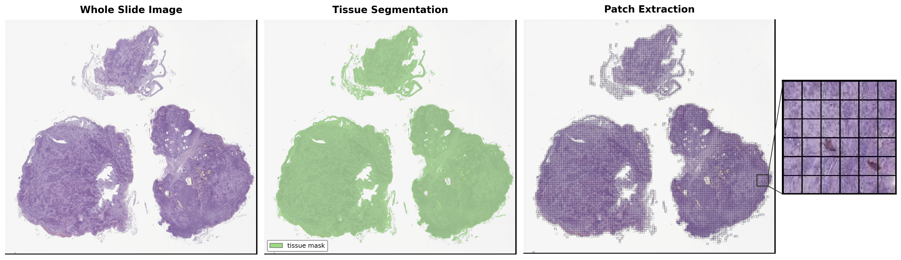

# hs2p

<p>
    <a href="https://pypi.org/project/hs2p"></a>
    <a href="https://pypi.org/project/hs2p"></a>
    <a href="https://github.com/psf/black"></a>
    <a href="https://github.com/PyCQA/pylint"></a>
    <a href="https://huggingface.co/spaces/waticlems/hs2p-demo"></a>
</p>

`hs2p` is a Python package for fast, scalable whole-slide tiling and annotation-aware sampling. You can request tiles at any spacing, whether or not that spacing is natively present in the image pyramid. It is designed for computational pathology workflows that need reproducible coordinates, explicit artifacts, and backend-independent physical semantics.

We support two main workflows:

- a Python API for library-style integration
- a CLI for batch preprocessing

## Demo

Try hs2p interactively: **[hs2p-demo on HuggingFace Spaces](https://huggingface.co/spaces/waticlems/hs2p-demo)**  
You can adjust tiling parameters and inspect the resulting grid and mask previews.  
You can also upload your own pyramidal WSI (up to 1 GB).

## Installation

Base install:

```bash
pip install hs2p
```

Optional backend extras:

```bash
pip install "hs2p[openslide]"
pip install "hs2p[asap]"
pip install "hs2p[vips]"
pip install "hs2p[cucim]"
pip install "hs2p[all]"
```

The supported backend set is:

- `auto`
- `cucim`
- `vips`
- `openslide`
- `asap`

`auto` prefers `cucim -> vips -> openslide -> asap`.

## Workflows

### Tiling

Tiling computes a reproducible grid of tile coordinates for each slide and saves them as explicit named artifacts. When a precomputed tissue mask is not provided, `hs2p` segments tissue on the fly. If you want to create those masks ahead of time, a [standalone script](docs/tissue-mask-generation.md) is available.



### Sampling

Sampling filters or partitions tile coordinates by annotation coverage so you can keep only tiles relevant to a label or tissue class.


## Python API

Minimal tiling example:

```python
from pathlib import Path

from hs2p import (
    SlideSpec,
    TilingConfig,
    tile_slide,
    save_tiling_result,
    write_tiling_preview,
)

result = tile_slide(
    SlideSpec(
        sample_id="slide-1",
        image_path=Path("/data/wsi/slide-1.tif"),
        mask_path=Path("/data/mask/slide-1-tissue-mask.tif"), # optional
    ),
    tiling=TilingConfig(
        backend="openslide",
        target_spacing_um=0.5,
        target_tile_size_px=224,
        tolerance=0.07,
        overlap=0.0,
        tissue_threshold=0.1,
    ),
)

# save tiling results to disk
artifacts = save_tiling_result(result, output_dir=Path("output"))

print(artifacts.coordinates_npz_path)   # output/tiles/slide-1.coordinates.npz
print(artifacts.coordinates_meta_path)  # output/tiles/slide-1.coordinates.meta.json

# preview tile grid
tiling_preview_path = write_tiling_preview(
    result=result,
    output_dir=Path("output"),
    downsample=32,
)
print(tiling_preview_path)  # output/preview/tiling/slide-1.jpg
```

`result` is a canonical `hs2p.preprocessing.TilingResult`. Downstream code should use its structured fields such as:

- `x`
- `y`
- `tissue_fractions`
- `tile_index`
- `requested_*`
- `effective_*`
- `min_tissue_fraction`

More API details: [docs/api.md](docs/api.md)

## CLI

The CLI is intended for fast batch processing of multiple slides with the same config.  
Both entrypoints read the same public `mask_path` column, and the command determines whether that path is treated as a tissue mask or an annotation mask:

Tiling csv (`mask_path` is optional and means a tissue mask here):

```csv
sample_id,image_path,mask_path
slide-1,/data/wsi/slide-1.tif,/data/mask/slide-1-tissue-mask.tif
slide-2,/data/wsi/slide-2.tif,
...
```

Sampling csv (`mask_path` is mandatory and means an annotation mask here):

```csv
sample_id,image_path,mask_path
slide-1,/data/wsi/slide-1.tif,/data/mask/slide-1-annotations.tif
slide-2,/data/wsi/slide-2.tif,/data/mask/slide-2-annotations.tif
...
```

Run tiling:

```bash
python -m hs2p.cli.tiling --config-file /path/to/config.yaml
```

Run sampling:

```bash
python -m hs2p.cli.sampling --config-file /path/to/config.yaml
```

For a first run, start from [hs2p/configs/default.yaml](hs2p/configs/default.yaml) and edit only the essentials:

- `csv`
- `output_dir`
- `tiling.backend`
- `tiling.params.target_spacing_um`
- `tiling.params.target_tile_size_px`


More details about CLI: [docs/cli.md](docs/cli.md)

## Outputs

`hs2p` writes explicit named artifacts rather than anonymous coordinate dumps.

- Tiling writes `tiles/{sample_id}.coordinates.npz` and `tiles/{sample_id}.coordinates.meta.json`
- Sampling writes the same pair under `tiles/<annotation>/`
- Batch runs also write `process_list.csv`
- Saved coordinate arrays use a deterministic order: numeric `x` first, then numeric `y` within each shared `x`

Artifact field reference: [docs/artifacts.md](docs/artifacts.md)

## Docker

[](https://hub.docker.com/r/waticlems/hs2p)

If you prefer running `hs2p` in a container, a published Docker image is available:

```bash
docker pull waticlems/hs2p:latest
docker run --rm -it -v /path/to/your/data:/data waticlems/hs2p:latest
```

## Documentation

- [Documentation index](docs/README.md)
- [Python API guide](docs/api.md)
- [CLI guide](docs/cli.md)
- [Artifact format reference](docs/artifacts.md)
- [Benchmark notes](docs/benchmark.md)
- [Tissue mask generation script](docs/tissue-mask-generation.md)
