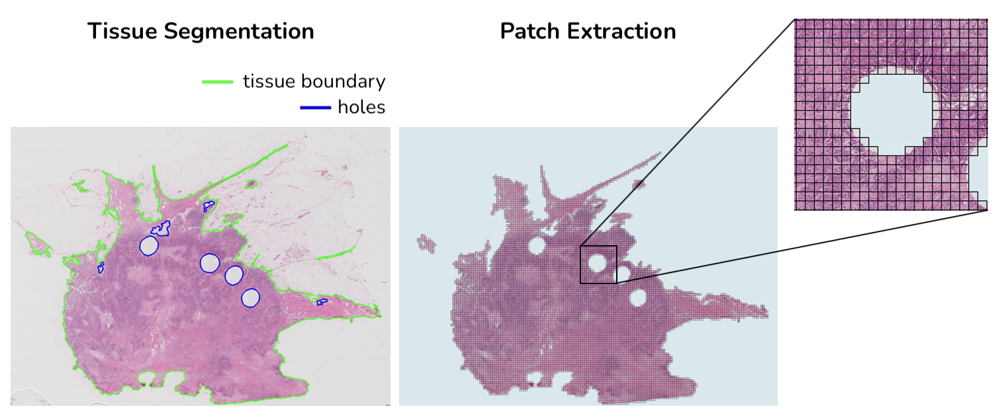
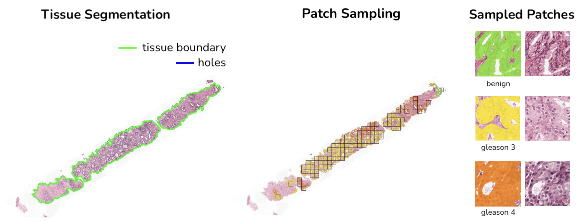

<h1 align="center">Histopathology Slide Pre-processing Pipeline</h1>

[](https://pypi.org/project/hs2p/)
[](https://hub.docker.com/r/waticlems/hs2p)


HS2P is an open-source project largely based on [CLAM](https://github.com/mahmoodlab/CLAM) tissue segmentation and patching code.

<p>
   <a href="https://github.com/psf/black"></a>
   <a href="https://github.com/PyCQA/pylint"></a>
</p>

## 🛠️ Installation

System requirements: Linux-based OS (e.g., Ubuntu 22.04) with Python 3.11+ and Docker installed.

We recommend running the script inside a container using the latest `hs2p` image from Docker Hub:

```shell
docker pull waticlems/hs2p:latest
docker run --rm -it \
    -v /path/to/your/data:/data \
    waticlems/hs2p:latest
```

Replace `/path/to/your/data` with your local data directory.

Alternatively, you can install `hs2p` via pip:

```shell
pip install hs2p
```

## Usage

HS2P now exposes two complementary interfaces:

- a **Python API** for library-style use inside your own code
- a **CLI workflow** for batch preprocessing from a config file

## Python API

The top-level package exports the public Python-first tiling API:

```python
from pathlib import Path

from hs2p import (
    FilterConfig,
    QCConfig,
    SegmentationConfig,
    TilingConfig,
    WholeSlide,
    tile_slide,
    tile_slides,
)
```

### Core types

- `WholeSlide`: identifies one sample through `sample_id`, `image_path`, and optional `mask_path`
- `TilingConfig`: describes the requested physical tile spacing, tile size, overlap, tissue threshold, padding behavior, and backend
- `SegmentationConfig`: describes how foreground tissue is segmented before coordinate extraction
- `FilterConfig`: describes contour-size and white/black filtering rules applied to candidate tiles
- `QCConfig`: controls whether mask and tiling previews are saved and at what preview downsample
- `TilingResult`: in-memory coordinates and metadata for one processed slide
- `TilingArtifacts`: on-disk artifact paths and tile count for one processed slide

### Core functions

- `tile_slide(...)`: compute a `TilingResult` for one `WholeSlide`; this is the compute-only path and does not write preview images
- `tile_slides(...)`: batch process multiple slides, write artifacts, optionally write previews, and return `TilingArtifacts`
- `save_tiling_result(...)`: persist a `TilingResult` to `.tiles.npz` and `.tiles.meta.json`
- `load_tiling_result(...)`: reconstruct a `TilingResult` from named artifacts on disk

Minimal example:

```python
from pathlib import Path

from hs2p import (
    FilterConfig,
    QCConfig,
    SegmentationConfig,
    TilingConfig,
    WholeSlide,
    tile_slide,
)

result = tile_slide(
    WholeSlide(sample_id="slide-1", image_path=Path("/data/slide1.tif")),
    tiling=TilingConfig(
        target_spacing_um=0.5,
        target_tile_size_px=256,
        tolerance=0.05,
        overlap=0.0,
        tissue_threshold=0.01,
        drop_holes=False,
        use_padding=True,
        backend="asap",
    ),
    segmentation=SegmentationConfig(
        downsample=64,
        sthresh=8,
        sthresh_up=255,
        mthresh=7,
        close=4,
        use_otsu=False,
        use_hsv=True,
    ),
    filtering=FilterConfig(
        ref_tile_size=16,
        a_t=4,
        a_h=2,
        max_n_holes=8,
        filter_white=False,
        filter_black=False,
        white_threshold=220,
        black_threshold=25,
        fraction_threshold=0.9,
    ),
    qc=QCConfig(save_mask_preview=False, save_tiling_preview=False),
)
```

## CLI

### Input CSV schema

Both CLI entrypoints expect the same CSV schema:

```csv
sample_id,image_path,mask_path
slide-1,/path/to/slide1.tif,/path/to/mask1.tif
slide-2,/path/to/slide2.tif,
```

- `sample_id`: stable identifier used to name output artifacts
- `image_path`: path to the whole-slide image to process
- `mask_path`: optional path to a tissue or annotation mask aligned to the same sample

### Tiling CLI



Run slide tiling with:

```shell
python3 -m hs2p.tiling --config-file </path/to/config.yaml>
```

Important config entries in `hs2p/configs/default.yaml`:

- `csv`: path to the input CSV described above
- `output_dir`: directory where artifacts, visualizations, and `process_list.csv` are written
- `resume`: whether to trust the current-schema `process_list.csv` in `output_dir`
- `visualize`: whether to write mask and tiling preview images
- `tiling.read_tiles_from`: optional directory containing precomputed `{sample_id}.tiles.npz` and `{sample_id}.tiles.meta.json` files to reuse instead of recomputing
- `tiling.backend`: slide-reading backend, for example `asap`
- `tiling.params.target_spacing_um`: target tile resolution in microns per pixel
- `tiling.params.target_tile_size_px`: requested tile width and height in pixels at the target spacing
- `tiling.params.tolerance`: allowed relative spacing mismatch when selecting the best pyramid level
- `tiling.params.overlap`: fractional overlap between neighboring tiles
- `tiling.params.tissue_threshold`: minimum tissue fraction required to keep a tile during tiling
- `tiling.params.drop_holes`: whether tiles centered inside detected tissue holes should be discarded
- `tiling.params.use_padding`: whether border tiles may extend beyond the native slide bounds and be padded
- `tiling.seg_params.*`: tissue segmentation parameters used before coordinate extraction
- `tiling.filter_params.*`: contour and white/black filtering parameters applied after segmentation
- `tiling.visu_params.downsample`: downsample factor for preview rendering
- `speed.num_workers`: worker count used for slide processing

### Sampling CLI



Run tile sampling with:

```shell
python3 -m hs2p.sampling --config-file </path/to/config.yaml>
```

Sampling uses the same base tiling/segmentation/filtering settings as `hs2p.tiling`, plus:

- `tiling.sampling_params.independant_sampling`: whether each annotation is sampled independently or sampled jointly with cross-category exclusion
- `tiling.sampling_params.pixel_mapping`: mapping from annotation name to the pixel value used in the mask
- `tiling.sampling_params.color_mapping`: optional overlay color for each annotation in previews
- `tiling.sampling_params.tissue_percentage`: minimum coverage required for each annotation to keep or sample a tile

## Artifacts and Outputs

Both the CLI and the Python API write named artifacts under the configured output directory.

### Coordinate artifacts

- `hs2p.tiling` writes one artifact pair per slide under `coordinates/`
- `hs2p.sampling` writes one artifact pair per annotation under `coordinates/<annotation>/`

For each successful output, HS2P writes:

- `{sample_id}.tiles.npz`: the coordinate arrays themselves
- `{sample_id}.tiles.meta.json`: metadata describing what those coordinates represent

### `.tiles.npz` arrays

- `tile_index`: contiguous tile ids from `0` to `num_tiles - 1`; this is the stable per-artifact row order
- `x_lv0`: x-coordinate of the tile origin in level-0 slide pixels
- `y_lv0`: y-coordinate of the tile origin in level-0 slide pixels
- `tissue_fraction`: optional per-tile tissue fraction measured during extraction; present only when HS2P has that information available

### `.tiles.meta.json` fields

- `sample_id`: sample identifier that produced the artifact and also names the output files
- `image_path`: slide path used to generate or validate the coordinates
- `mask_path`: mask path used during generation, or `null` when no mask was provided
- `backend`: slide-reading backend used during extraction, for example `asap`
- `target_spacing_um`: requested tile resolution in microns per pixel
- `target_tile_size_px`: requested tile width and height in pixels at `target_spacing_um`
- `read_level`: pyramid level actually read from the WSI during extraction
- `read_spacing_um`: physical spacing of `read_level`; this is the native resolution that was actually read before any resizing
- `read_tile_size_px`: tile width and height at `read_level`; this is the read-time pixel size before mapping back to level 0
- `tile_size_lv0`: tile width and height expressed in level-0 slide pixels
- `overlap`: fractional overlap that was requested between adjacent tiles
- `tissue_threshold`: minimum tissue fraction required to keep a tile in tiling mode
- `num_tiles`: number of tiles stored in the artifact
- `config_hash`: hash of the effective tiling, segmentation, and filtering configuration used to validate artifact reuse

### Visualizations

If `visualize: true`, HS2P writes preview images under `visualization/`:

- `visualization/mask/`: low-resolution renderings of the tissue or annotation mask
- `visualization/tiling/`: low-resolution renderings of extracted tiling coordinates
- `visualization/sampling/`: low-resolution renderings of sampled coordinates, with per-annotation subdirectories when applicable

Mask contour line thickness is automatically inferred from the whole-slide dimensions and the visualization level so previews remain readable across small biopsies and large resections.

For sampling visualizations, overlays are drawn only for annotations whose `color_mapping` is not `null`.

### `process_list.csv`

`process_list.csv` summarizes the batch run in the current schema only.

Tiling columns:

- `sample_id`: sample identifier from the input CSV
- `image_path`: slide path associated with that sample
- `mask_path`: mask path associated with that sample, or empty when absent
- `tiling_status`: `success` or `failed`
- `num_tiles`: number of tiles written for that sample
- `tiles_npz_path`: path to the saved `.tiles.npz` file
- `tiles_meta_path`: path to the saved `.tiles.meta.json` file
- `error`: error message when tiling failed
- `traceback`: Python traceback when tiling failed

Sampling columns:

- `sample_id`: sample identifier from the input CSV
- `image_path`: slide path associated with that sample
- `mask_path`: annotation mask path associated with that sample
- `sampling_status`: `success`, `failed`, or pending state before processing
- `error`: error message when sampling failed
- `traceback`: Python traceback when sampling failed

When `resume: true`, HS2P expects both `process_list.csv` and any referenced artifacts to use this current schema. Reused tiling artifacts are validated against `sample_id`, `config_hash`, `image_path`, and `mask_path`.

## Standalone tissue segmentator

For quick mask generation outside the full pipeline, use the standalone script:

```shell
python -m pip install tifffile # need extra tifffile deps

# Single slide
python scripts/generate_tissue_mask.py \
    --wsi /path/to/slide.tif \
    --output /path/to/tissue-mask-pyramid.tif \
    --spacing 4.0 \
    --tolerance 0.1

# Multiple slides
python scripts/generate_tissue_mask.py \
    --wsi /path/to/slide_dir/*.tif \
    --output-dir /path/to/output_dir \
    --spacing 4.0 \
    --tolerance 0.1
```

This script:
- reads the WSI with `wholeslidedata`
- computes a binary tissue mask using HSV thresholding (`0=background`, `1=tissue`)
- uses a coarse-to-fine ROI shortcut by default to avoid loading the full target-spacing WSI into memory
- writes a pyramidal TIFF mask at a desired `spacing`, where each level is downsampled from the previous one
- prints a final recap of how many slides succeeded, skipped, and failed

Useful options:
- `--backend` to switch the wholeslidedata backend (default: `asap`)
- `--output` for single-slide mode and `--output-dir` for multi-slide mode
- `--num-workers` to control parallelism
- `--no-cache` to disable cache-based skipping and force recomputation
- `--disable-coarse-roi-shortcut` to force legacy full-frame loading at target spacing
- `--coarse-spacing`, `--coarse-roi-margin-um`, and `--processing-tile-size` to tune coarse-to-fine ROI processing
- `--tolerance` to control how much a natural spacing can deviate from target spacing when selecting the best level for reading the whole slide
- `--min-component-area-um2` to remove tiny tissue blobs
- `--min-hole-area-um2` to fill small holes inside tissue
- `--gaussian-sigma-um` to apply optional pre-threshold Gaussian smoothing
- `--open-radius-um` / `--close-radius-um` for spacing-aware morphological smoothing
- `--spacing-at-level-0` to override level-0 spacing when metadata is incorrect
- `--compression` and `--tile-size` to tune TIFF output

The summary file is saved as `summary.csv` in `--output-dir` (multi-slide mode) or next to `--output` (single-slide mode).
The cache manifest used for skip inference is saved as `cache_manifest.json` in the same directory.
