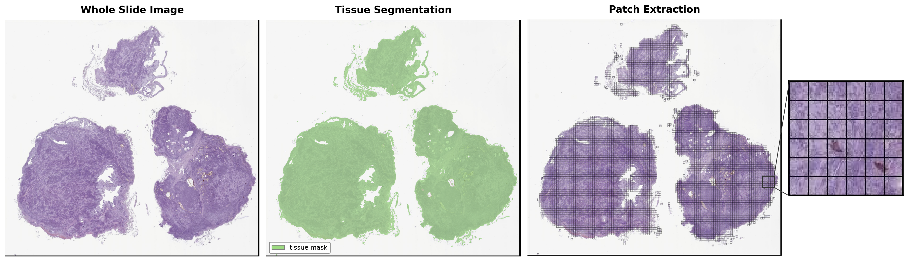
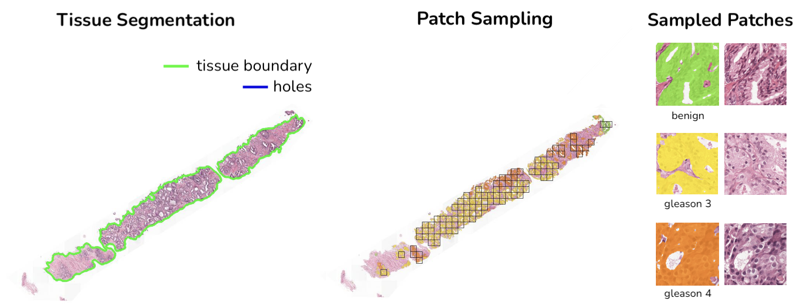

# hs2p

<p>
    <a href="https://pypi.org/project/hs2p"></a>
    <a href="https://pypi.org/project/hs2p"></a>
    <a href="https://github.com/psf/black"></a>
    <a href="https://github.com/clemsgrs/hs2p"></a>
    <a href="https://huggingface.co/spaces/waticlems/hs2p-demo"></a>
</p>

`hs2p` tiles whole-slide images at a requested physical resolution (microns per pixel), including resolutions absent from the image pyramid. Use the Python API in your own pipeline or the CLI for batch preprocessing. Both produce reproducible tile coordinates and can select tiles by tissue or annotation coverage.

Try the [interactive demo](https://huggingface.co/spaces/waticlems/hs2p-demo) to adjust tiling parameters and inspect grids and mask previews, including on your own pyramidal WSI (up to 1 GB).

## Installation

Python 3.10 or newer is required. For whole-slide images read with OpenSlide:

```bash
pip install "hs2p[openslide]"
```

For flat PNG/JPEG inputs, `pip install hs2p` is sufficient; supply their physical spacing with `spacing_at_level_0`. See the [backend guide](docs/cli.md#backends) for other readers, optional JPEG encoding, and SAM2 installation.

## Workflows

Tiling computes a grid over tissue, using a supplied mask or segmenting tissue on the fly. Masks can have a different resolution from the slide. To prepare masks in advance, use the [tissue-mask generation script](docs/tissue-mask-generation.md).



Annotation sampling selects tiles by label coverage and writes per-class or merged coordinates.



## Python quick start

```python
from pathlib import Path

from hs2p import (
    SegmentationConfig,
    SlideSpec,
    TilingConfig,
    save_tiling_result,
    tile_slide,
    write_tiling_preview,
)

result = tile_slide(
    SlideSpec(
        sample_id="slide-1",
        image_path=Path("/data/wsi/slide-1.tif"),
        # Optional: omit to segment tissue on the fly.
        mask_path=Path("/data/mask/slide-1-tissue-mask.tif"),
    ),
    tiling=TilingConfig(
        backend="openslide",
        mask_backend="openslide",
        requested_spacing_um=0.5,
        requested_tile_size_px=224,
        tolerance=0.07,
        overlap=0.0,
        min_coverage={"tissue": 0.1},
    ),
    segmentation=SegmentationConfig(method="hsv", downsample=64),
)

artifacts = save_tiling_result(result, output_dir=Path("output"))
print(artifacts.coordinates_meta_path)  # output/tiles/slide-1.coordinates.meta.json

if result.x.size:
    print(artifacts.coordinates_npz_path)  # output/tiles/slide-1.coordinates.npz
    write_tiling_preview(result=result, output_dir=Path("output"), downsample=32)
```

`tile_slide()` returns an in-memory `TilingResult`; `tile_slides()` processes a batch and saves its results. See the [API guide](docs/api.md) for result fields, batch processing, and artifact loading.

## CLI quick start

Create `slides.csv` with a unique `sample_id` and an `image_path` for each slide. `mask_path` is optional for tissue tiling:

```csv
sample_id,image_path,mask_path
slide-1,/data/wsi/slide-1.tif,/data/mask/slide-1-tissue-mask.tif
slide-2,/data/wsi/slide-2.tif,
```

Save this as `config.yaml`; omitted settings inherit the [default config](hs2p/configs/default.yaml):

```yaml
csv: slides.csv
output_dir: output
tiling:
  backend: openslide
  params:
    requested_spacing_um: 0.5
    requested_tile_size_px: 224
```

Run:

```bash
hs2p config.yaml
```

Results go into a dated subdirectory of `output`. Annotation sampling uses the same command and CSV schema, with a required annotation `mask_path` and label settings under `tiling.masks`. See the [CLI guide](docs/cli.md) for sampling, previews, tile export, and resume.

## Outputs

Each non-empty result saves `.coordinates.npz` arrays and `.coordinates.meta.json` metadata. Empty results save metadata only. Coordinates are in level-0 pixels, sorted by numeric `x`, then `y`.

Tissue tiling writes under `tiles/`; annotation sampling can write under `tiles/<annotation>/` or merge results under `tiles/`. Batch runs also write `process_list.csv`. The [artifact reference](docs/artifacts.md) describes paths, fields, and reuse compatibility.

## Docker

[](https://hub.docker.com/r/waticlems/hs2p)

Run the CLI in the published container:

```bash
docker pull waticlems/hs2p:latest
docker run --rm -v /path/to/your/data:/data \
  waticlems/hs2p:latest hs2p /data/config.yaml
```

Use paths inside the container in the CSV and config, and set `output_dir` under `/data` to retain results on the host. The mounted output directory must be writable by the container user.

Continue with the [documentation index](docs/README.md) for guides, benchmarks, and release notes.
